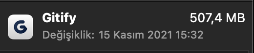

# Gitification (WORK IN PROGRESS)

A gitify clone. The reason why I develop this is, gitify uses 500mb of my disk because of electron and that is too much. Tauri uses system's webview so apps can be just 1 or 2 mb.

 Just to read notifications I don't wanna use 500 mb of my disk.

 

  

 
 

## Video of the app (Updated at: 6 February 2023)

  <video  src="./videos/app.mp4">

