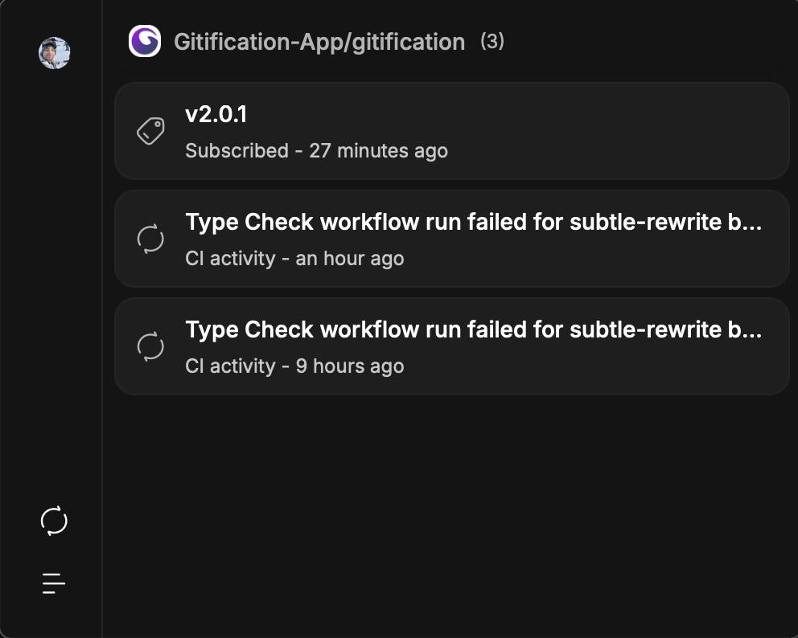
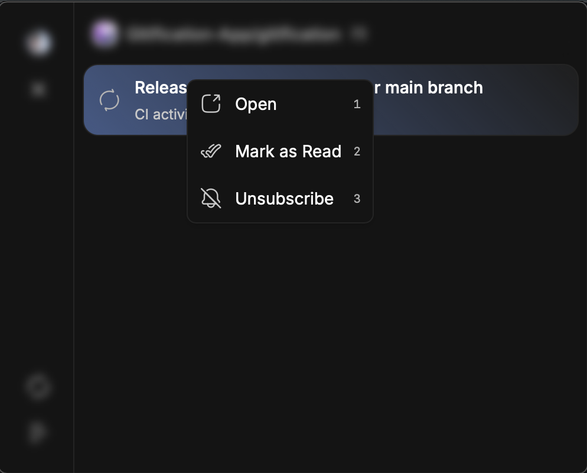

# Gitification - Menubar App for Github Notifications

 

Gitification is a lightweight desktop application that notifies you when you have new notifications on Github. It sits on your menubar and gets your attention with a sound.

- Lightweight `Nearly 10mb`. Uses Tauri so doesn't ship with a browser engine.
- Easy to login `Uses Github Oauth flow`.

[Download from releases](https://github.com/Gitification-App/gitification/releases)

### Screenshots

  

