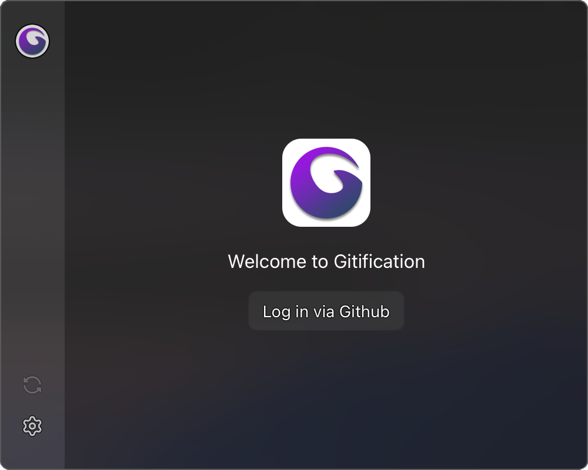

<div align="center">
  
</div>

# Gitification (Beta)
An app to view your notifications easily on your menubar.

- Gitification uses Tauri under the hood, so it does not ship a 200mb chrome browser. App size is just lower than 20 or 10mb.

- Gitification doesn't make you type your username and password, auth is done in browser with a single click.

- Gitification is built with `TypeScript`, `Vue`, `Tauri` and `Vite` with nice plugins.

# Size Comparison with Gitify
<div align="center">
  
</div>


# Screenshots
<div align="center">
  
</div>
<br>
<div align="center">
  
</div>
<br>
<div align="center">
  
</div>

# Known Problems
-  Gitification is not certificated by an apple developer account, after you download it you have to allow it in `Preference/Privacy & Securiy`. I don't earn money from open source, but if I earn `50$` from github sponsorships, I will sign the app.

- The app is currently ready to be compiled for Windows or Linux but I'm a Mac user so that after I added the features in my mind, I will create Windows and Linux builds.

# Building The App
If you want to build Gitification by yourself:

- Install rust and cargo.
- Install pnpm `npm install -g pnpm`
- Install packages `pnpm install`
- Create `.env` file, you can see required fields in `.env.example`.
- Build the app `pnpm tauri build`
- After that you can find executable in `src-tauri/target` folder.

# Contributing
If you want to contribute you should install these extensions and set-up these settings.

- Install `Eslint` from vscode marketplace.
- Install `Volar` from vscode marketplace.
- Add the following settings to your `.vscode/settings.json`

  ```json
  {
    "[rust]": {
      "editor.defaultFormatter": "rust-lang.rust-analyzer"
    },
    "eslint.enable": true,
    "editor.codeActionsOnSave": {
      "source.fixAll.eslint": true
    },
    "volar.completion.normalizeComponentImportName": true,
    "volar.completion.preferredAttrNameCase": "camel",
    "volar.completion.preferredTagNameCase": "pascal"
  }
  ```
- And lastly in extensions page search `@builtin typescript` then disable TypeScript LSP for your workspace, after reloading vscode you're good to go.
