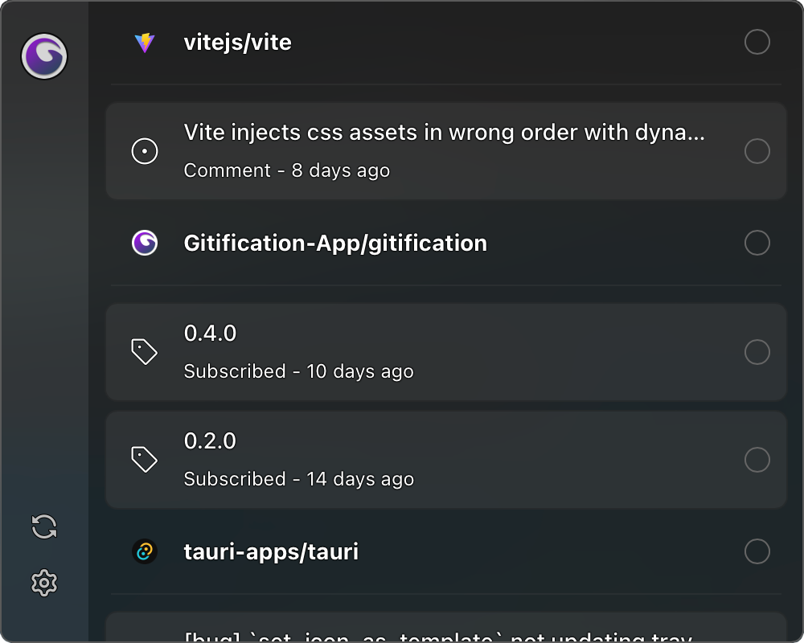

<div align="center">
  
</div>

<div align="center">

  [Download page](https://gitification.app/)

</div>

# Gitification (Beta)
An app to view your notifications easily on your menubar.

- Gitification uses Tauri under the hood, so it does not ship a 200mb chrome browser. App size is just lower than 20 or 10mb.

- Gitification doesn't make you type your username and password, auth is done in browser with a single click.

- Gitification is built with `TypeScript`, `Vue`, `Tauri` and `Vite` with nice plugins.

# Size Comparison with Gitify
<div align="center">
  
</div>

# Screenshots
<div align="center">
  
  
</div>

# Building The App
If you want to build Gitification by yourself:

- Install rust and cargo.
- Install pnpm `npm install -g pnpm`
- Install packages `pnpm install`
- Create `.env` file, you can see required fields in `.env.example`.
- Build the app `pnpm tauri build`
- After that you can find executable in `src-tauri/target` folder.

# Contributing
If you want to contribute you should install these extensions and set-up these settings.

- Install `Eslint` from vscode marketplace.
- Install `Volar` from vscode marketplace.
- Add the following settings to your `.vscode/settings.json`

  ```json
  {
    "prettier.enable": false,
    "editor.formatOnSave": false,
    "editor.codeActionsOnSave": {
      "source.fixAll.eslint": "explicit",
      "source.organizeImports": "never"
    },
    "eslint.rules.customizations": [
      { "rule": "style/*", "severity": "off" },
      { "rule": "format/*", "severity": "off" },
      { "rule": "*-indent", "severity": "off" },
      { "rule": "*-spacing", "severity": "off" },
      { "rule": "*-spaces", "severity": "off" },
      { "rule": "*-order", "severity": "off" },
      { "rule": "*-dangle", "severity": "off" },
      { "rule": "*-newline", "severity": "off" },
      { "rule": "*quotes", "severity": "off" },
      { "rule": "*semi", "severity": "off" }
    ],
    "eslint.validate": [
      "javascript",
      "javascriptreact",
      "typescript",
      "typescriptreact",
      "vue",
      "html",
      "markdown",
      "json",
      "jsonc",
      "yaml",
      "toml"
    ],
    "[rust]": {
      "editor.defaultFormatter": "rust-lang.rust-analyzer"
    },
    "editor.defaultFormatter": "dbaeumer.vscode-eslint",
    "eslint.enable": true,
    "eslint.experimental.useFlatConfig": true,
    "vue.complete.casing.props": "camel",
    "vue.complete.casing.tags": "pascal",
    "vue.complete.normalizeComponentImportName": true,
    "typescript.tsdk": "node_modules/typescript/lib"
  }
  ```
- And lastly in extensions page search `@builtin typescript` then disable TypeScript LSP for your workspace, after reloading vscode you're good to go.
